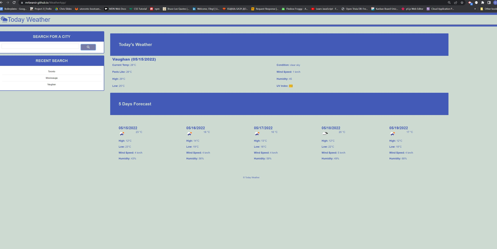

<h># WeatherApp</h>
# Student Id.
# Oleg Dobrovolskyi

# Repository Link
https://github.com/MrBearSir/WeatherApp

# Live Page URL
https://mrbearsir.github.io/WeatherApp

# Project type.
Server-Side API

# User Story.
AS A traveler
I WANT to see the weather outlook for multiple cities
SO THAT I can plan a trip accordingly

# Skills used in development.
<ul>
<li>Using HTML and CSS skills to build dynamically updated HTML and CSS.</li>
<li>JS skills to do the API fetch calls and populate the data with it.</li>
<li>Git tech to update, upload, merge repos and create the remote repo.</li>
</ul>